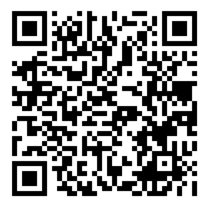

# Web Browser / WiFi Controlled RC Car

## Hardware
- 2 Brushless Motor's RC Car, rescued from old broken toy
- ESP32 C3 Super Mini
- DRV8833 Motor Driver
- Step/Up converter and charger LiPo module
- 2200 mAh rescued Samsung battery from broken Smartphone
- 4 Years old Son inspiration :P

## Goals
- On board webserver/websockets controller to use any smartphone/PC
- Battery Powered
- Wifi Manager
- Low Power

### Sources
- [ESP32 Super Mini](https://github.com/sidharthmohannair/Tutorial-ESP32-C3-Super-Mini)
- [WiFI Manager](https://randomnerdtutorials.com/esp32-wi-fi-manager-asyncwebserver/)
  - ESPAsyncWebServer
  - AsyncTCP
- [Web Sockets Server](https://randomnerdtutorials.com/esp32-websocket-server-arduino/)
- [HTML 5 Joystick](https://github.com/bobboteck/JoyStick)

## BLE Version
- Copy ./samples/remote_XY_ble.cpp to ./src and rename to main.cpp
- Platform -> Erase Flash
- Platform -> Upload
- Install RemoteXY on mobile or tablet: https://remotexy.com/en/download/
- Add `BT-CAR-ESP32` BLE device on RemoteXY or scan this QR  

## Working Samples
- WiFi Manager
  - Copy ./samples/wifi-manager.cpp to ./src and rename it to main.cpp
  - Copy ./web/wifi-manager/ files to ./data
  - Platform -> Build & Upload Filesystem
  - Platform -> Build & Upload Code
- Websockets Server
  - Copy ./samples/ws-server.cpp to ./src and rename it to main.cpp
  - Copy ./web/websockets-server/ files to ./data
  - Platform -> Build & Upload Filesystem
  - Platform -> Build & Upload Code
